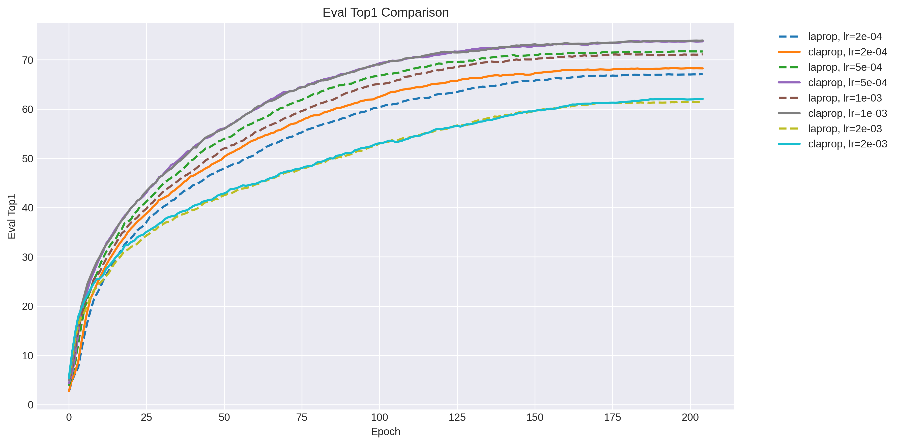
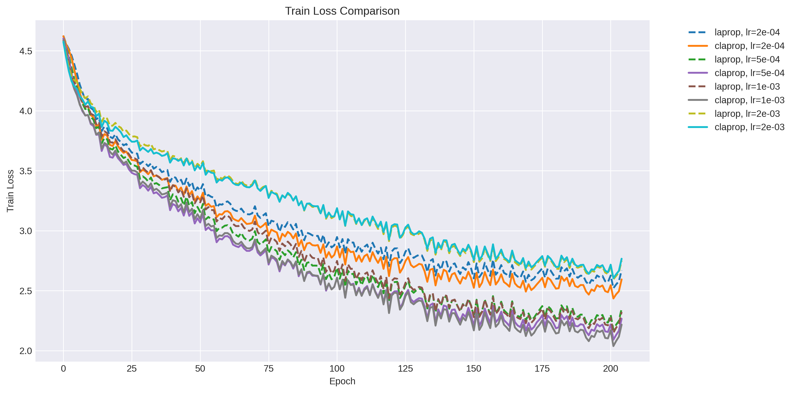
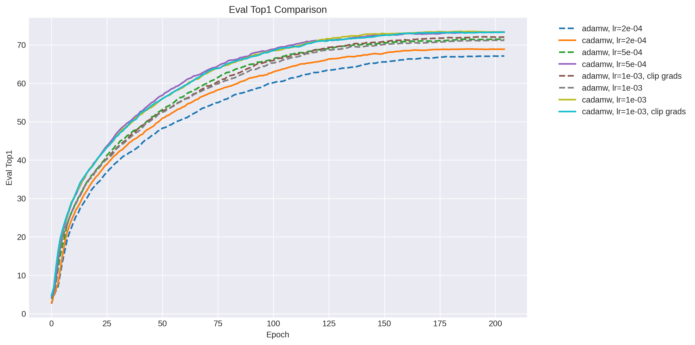
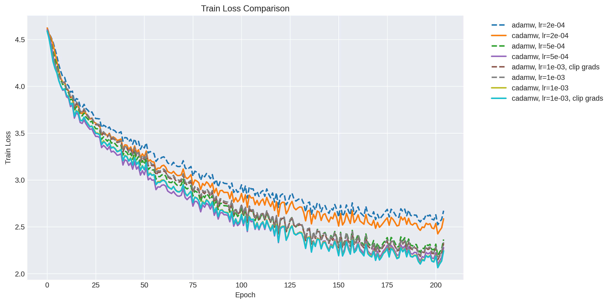
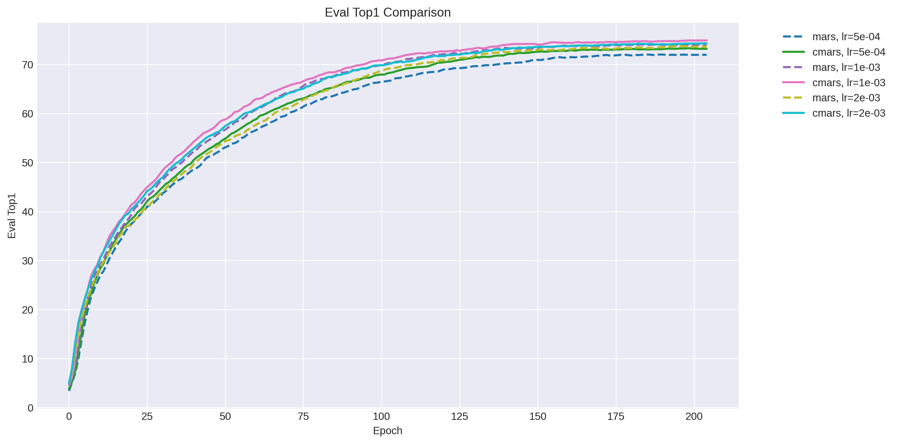
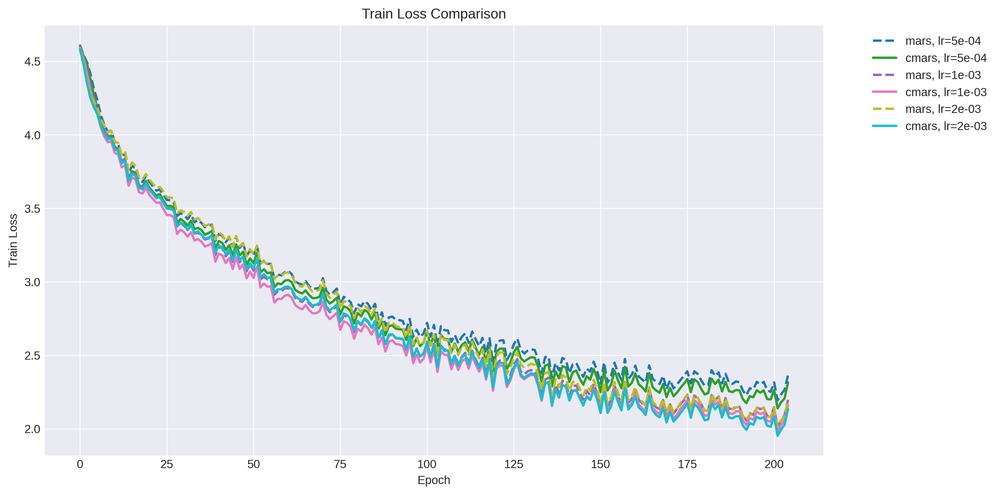

# Comparisons of baseline Optimizers w/ Caution

This repo contains summaries of several sets of experiments comparing a number of optimizers with and without caution enabled.

The runs were all performed training a smaller ViT (`vit_wee_patch16_reg1_gap_256`) for 200 epochs (10M samples seen) from scratch on the `timm` 'mini-imagenet' dataset, a 100 class subset of imagenet with same image sizes as originals.

So far I have results for `adamw`, `laprop`, and `mars`. You can find full results in sub-folders by optimizer names. In all of these runs, the experiments with 'c' prefix in the name have caution enabled.

This is what the 'caution' addition looks like in an optimizer:
```python
    mask = (exp_avg * grad > 0).to(grad.dtype)
    mask.div_(mask.mean().clamp_(min=1e-3))
    exp_avg = exp_avg * mask
```

Train args:

```
./distributed_train.sh 2 --dataset hfds/timm/mini-imagenet --num-classes 100 --model vit_wee_patch16_reg1_gap_256 -j 8 --epochs 200 --warmup-prefix --sched-on-updates --warmup-lr 0 --mixup .2 --model-ema --model-ema-decay 0.999 --model-ema-warmup --aa rand-m9-mstd0.5-inc1 --remode pixel --reprob 0.25 --amp --weight-decay .05 --drop 0.1 --drop-path .1 -b 288 --opt cadamw --lr 1e-3
```

# LaProp

|optim                       |best_epoch|train_loss        |eval_loss         |eval_top1        |eval_top5        |lr                    |
|----------------------------|----------|------------------|------------------|-----------------|-----------------|----------------------|
|claprop, lr=1e-03           |204.0     |2.2173619270324707|1.0931779468536378|73.920000390625  |91.33000009765624|0.0                   |
|claprop, lr=5e-04           |183.0     |2.262192726135254 |1.0912627222061158|73.77000073242188|91.22000260009766|1.3478660293113704e-05|
|laprop, lr=5e-04            |198.0     |2.2425642013549805|1.1426102781295775|71.73000213623047|90.55000146484376|1.109508849230001e-06 |
|laprop, lr=1e-03            |179.0     |2.290040969848633 |1.168387135314941 |71.15000104980469|90.18000189208983|3.806023374435663e-05 |
|claprop, lr=2e-04           |195.0     |2.546172380447388 |1.2475446645736694|68.30000163574219|89.15000153808593|9.97634228344235e-07  |
|laprop, lr=2e-04            |204.0     |2.6702351570129395|1.309178423690796 |67.07999990234374|88.67000270996094|0.0                   |
|claprop, lr=2e-03           |193.0     |2.678058862686157 |1.5239886917114258|62.08000177001953|84.8             |1.4890673845226132e-05|
|laprop, lr=2e-03            |200.0     |2.70467209815979  |1.522907255935669 |61.46000135498047|85.28000162353516|1.9732715717284413e-06|

## LaProp Top-1 Evaluation Accuracy on Mini-ImageNet


## LaProp Train Loss


# AdamW

|optim                       |best_epoch|train_loss        |eval_loss         |eval_top1        |eval_top5        |
|----------------------------|-----|------------------|------------------|-----------------|-----------------|
|cadamw, lr=1e-03            |184.0|2.2688851356506348|1.0868136840820313|73.52000141601563|91.60000036621092|
|cadamw, lr=5e-04            |199.0|2.163278102874756 |1.0976034646987916|73.3900005859375 |91.31000137939454|
|cadamw, lr=1e-03, clip grads|203.0|2.1360626220703125|1.1043113907814026|73.33000158691407|91.41000042724608|
|adamw, lr=1e-03, clip grads |195.0|2.2746386528015137|1.142998440361023 |72.11000151367188|90.47000052490236|
|adamw, lr=5e-04             |185.0|2.3040246963500977|1.1535791856765747|71.50000120849609|90.4800001953125 |
|adamw, lr=1e-03             |199.0|2.223684310913086 |1.1657958560943604|71.22999993896484|90.30999958496092|
|cadamw, lr=2e-04            |189.0|2.538627862930298 |1.2325929063796996|68.94999995117188|89.61000139160156|
|adamw, lr=2e-04             |203.0|2.579624652862549 |1.3085522148132325|67.11000026855469|88.66000164794922|

## AdamW Top-1 Evaluation Accuracy on Mini-ImageNet


## AdamW Train Loss


# MARS

|optim          |best_epoch|train_loss        |eval_loss         |eval_top1        |eval_top5        |
|---------------|----------|------------------|------------------|-----------------|-----------------|
|cmars, lr=1e-03|198.0     |2.054780960083008 |1.0435627010345458|74.91000185546875|92.08000146484376|
|cmars, lr=2e-03|203.0     |2.0272469520568848|1.0705795244216918|74.31000185546876|91.54000092773435|
|mars, lr=1e-03 |184.0     |2.219767808914185 |1.07215625667572  |74.06000178222656|91.6200013671875 |
|mars, lr=2e-03 |197.0     |2.1453990936279297|1.0963781481742858|73.73000098876953|91.1500006225586 |
|cmars, lr=5e-04|198.0     |2.2018630504608154|1.083557384109497 |73.32000045166015|91.67000092773438|
|mars, lr=5e-04 |189.0     |2.322845220565796 |1.1199828132629397|72.02999995117187|90.86000173339843|


## MARS Top-1 Evaluation Accuracy on Mini-ImageNet


## MARS Train Loss

